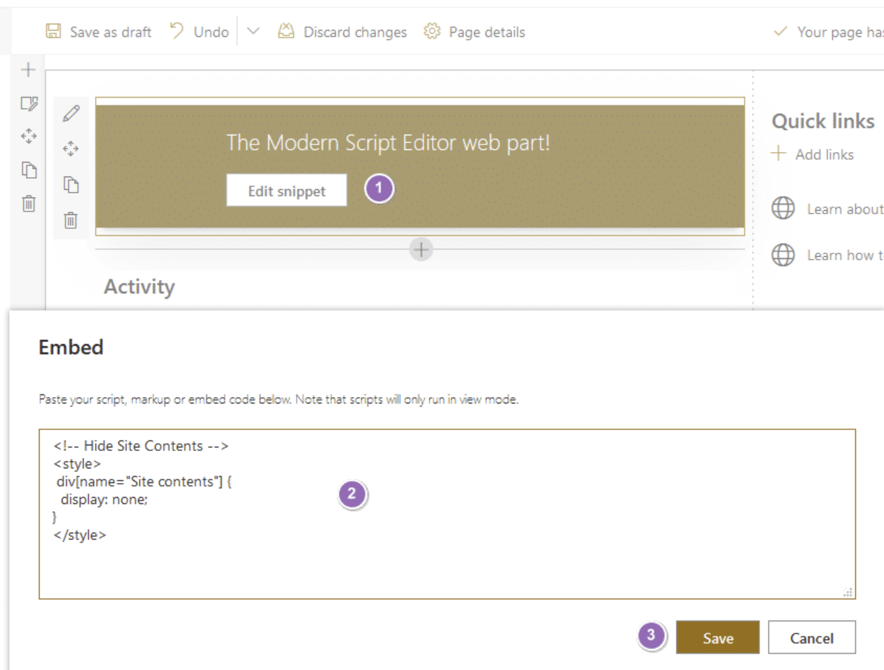

Rolling out SharePoint solutions without a disciplined approach quickly creates brittle customisations, blocked release pipelines, and unhappy users. 

<!--endintro-->

## 1. Use SharePoint Framework (SPFx)

SPFx delivers modern client-side web parts and extensions that run natively in SharePoint Online and in SharePoint 2016/2019

See: https://learn.microsoft.com/en-us/sharepoint/dev/spfx/sharepoint-framework-overview

For SharePoint Data, use https://pnp.github.io/pnpjs/
Use Graph APIs, custom graph connectors or even your own APIs to retrieve data as needed.

## 2. Avoid javascript injections

Script Editor webparts are deprecated, avoid using "modern" replacements found online

::: bad

Figure: Bad example – Injecting scripts bypasses governance and often breaks modern pages.

:::

✅ Good example - use out of the box replacements: https://support.microsoft.com/en-us/office/where-are-the-content-editor-and-script-editor-web-parts-in-sharepoint-ed6cc9ce-8b2a-480c-a655-1b9d7615cdbd

## 3. Don't use add-ins (retirement planned for 2026)

Provider-hosted add-ins (formerly "Apps") run outside SharePoint, usually in Azure, and call back through OAuth. They are retiring in 2026 and shouldn't be built anymore.

More info: https://learn.microsoft.com/en-us/sharepoint/dev/sp-add-ins/retirement-announcement-for-add-ins

## 3. Use modern toolchain

SPFX gives you access to a modern toolchain: TypeScript, React, Fluent UI, and Microsoft Graph. Use it to your advantage!

Don't neglect CI/CD for your SharePoint developments. The components (webparts, extensions...) might be smaller than you typical .NET project, but clean and repeatable deployment and provisioning is key to successful custom developments.

Use GitHub Actions or Azure DevOps pipelines to bundle, package, and deploy SPFx solutions. For custom assets deployment:

❌ Don't manually upload files to \*\*Site Assets\** or similar

✅ Deploy solutions through the App Catalog and ALM APIs 

## 4. Keep customisations upgrade-friendly

SharePoint Online ships changes weekly, and SharePoint Server receives regular updates. If you want to customize SharePoint look and feel:

❌ Do not rely on undocumented DOM markup that can change without warning.

✅ Use theme JSON, header/footer extensions, or the SharePoint Look Book.  

## 5. Respect the service boundary

Call Graph or SharePoint REST, not internal APIs:

* Use Microsoft Graph, or PnP libraries for data operations
* As a last resort, you can use \`_api/\` REST endpoints (although most of them will have a PNP wrapper)
* Subscribe to change notifications with webhooks, Graph API or Azure Event Grid

## 6. Apply the principle of least customisation

Configure first, extend only when necessary. Out-of-the-box lists, libraries, and Power Automate flows or even [list formatting](https://pnp.github.io/List-Formatting/) often cover 80% of business needs.

Check out existing solutions on GitHub before developing your own customizations.

Keep branding light; theme JSON and App Customisers beat CSS overrides.

## 7. Adopt the PnP community tools

The [PNP](https://pnp.github.io/) (formerly "Pattern N Practices") SharePoint community is awesome. They've got a heap of great tools available for o365 development:

* **PnP PowerShell** for scripting tenant or farm settings and deployments.  
* **PnP Core SDK** for strongly typed .NET access to SharePoint and Graph.  
* **PnP reusable React controls** for consistent Fluent UI components.  

And more!

## On-prem SharePoint development 🧓

Although many organisations are cloud-first, SharePoint Server is still alive and well. SPFX is compatible with virtually all SharePoint OnPrem setups (2016+), so all of the above applies. 

Keep these extra points in mind:

* **Stay patched** – install the latest cumulative updates after validating them in a test farm.  
* **Create a dedicated build farm** that mirrors production for reliable deployments.  
* **Automate feature upgrades** so schema changes apply cleanly across farms.  
* **Monitor ULS logs and Health Analyzer** rules; surface alerts in Azure Monitor or Splunk.  
* **Plan for future cloud migration** by isolating business logic in provider-hosted services or Azure Functions.

